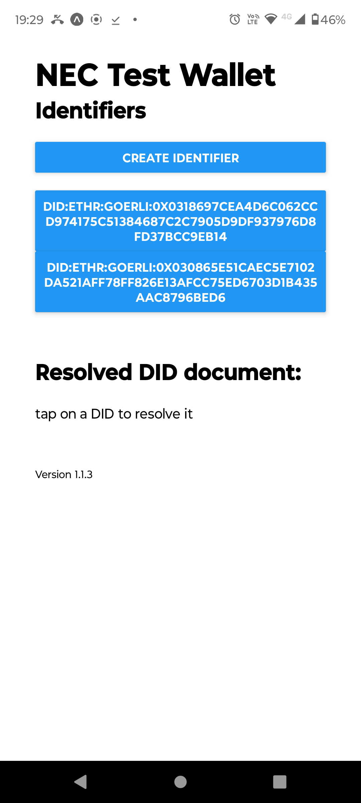

# SSI Wallet Prototype
##  Basis
The starting point for this project was https://github.com/veramolabs/veramo-react-native-tutorial.git .

## eas.projectId in app.json
Within app.json it was necessary to remove the eas.projectId value from the intial clone, I think because it was set to a value associated with the vermolabs project.

## Screendump
 
|  | 
|:--:| 
| *Sample Home Screen* |

## Firewall access from mobile device

I allowed access to all devices on the dev machine's subnet, which included my mobile when running from the local wi-fi, to port 19000 on the dev machine (the port used by Expo).

```
sudo ufw allow from 192.168.88.0/24 to any port 19000
```


